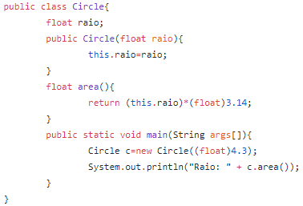

<h1>Trabalho Rust</h1> 

Integrantes: Caio Luiz Alonso Santana, Leonardo Fridman Bacellar

<h3>1-Introdução</h3>
Rust é uma linguagem multiparadigma que surgiu como projeto pessoal de Graydon Hoare, funcionário da Mozilla, e depois foi adotada pela empresa. A Mozilla começou a apoiar o projeto em 2009 e anunciou a linguagem em 2010, e seu compilador era escrito em OCaml e depois foi modificado para um compilador auto-hospedado em Rust conhecido como rustc, compilado pela primeira vez em 2011. A versão pré-alfa foi lançada pela primeira vez em 2012 e sua primeira versão estável, a Rust 1.0, foi lançada em 15 de maio de 2015.

<h3>2- Origens e Influências</h3>
Rust foi influenciado por Cyclone(uma linguagem imperativa derivada de C), com alguns recursos de orientação a objetos de C++ e recursos funcionais de linguagens como Haskell e OCaml. O resultado final é uma linguagem semelhante a C com suporte a programação multiparadigma(imperativa, funcional e orientada a objeto).
 

<h3>3-Classificação</h3>
Rust é uma linguagem orientada a objetos, estruturada, imperativa, concorrente e funcional com tipagem estática, forte e inferida.

<h3>4-Exemplos comparativos</h3>
-Java vs Rust(Cálculo da área de um círculo)

 

As diferenças de Rust para Java nesse código é que em Rust, os métodos e os campos são declarados em blocos diferentes.

<h3>-Referência bibliográfica</h3>

https://www.ibm.com/developerworks/br/library/os-developers-know-rust/index.html 
https://pt.wikipedia.org/wiki/Rust_(linguagem_de_programa%C3%A7%C3%A3o)

